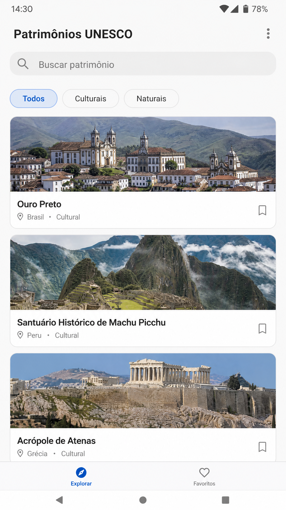
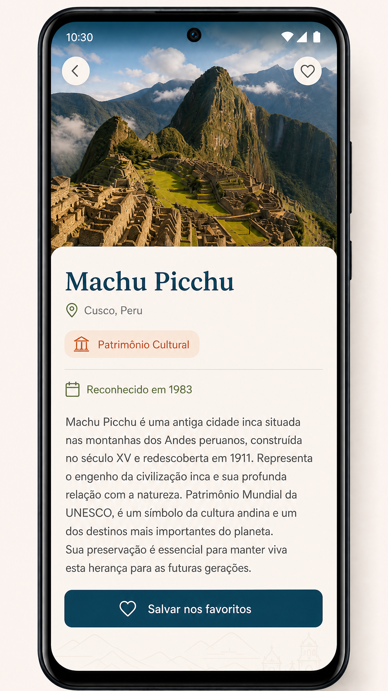

# Patrimônios UNESCO

Aplicativo Android feito em Kotlin e Jetpack Compose para consultar patrimônios históricos, culturais e naturais reconhecidos pela UNESCO.

O usuário pode criar uma conta, entrar no aplicativo, pesquisar locais, abrir os detalhes e salvar seus favoritos.

## Imagens do aplicativo

## Tecnologias

Kotlin, Jetpack Compose, Material 3, Firebase Authentication, Cloud Firestore, Navigation Compose e Coil.

## Como executar

Abra o projeto no Android Studio e aguarde a sincronização do Gradle. No Firebase, crie um aplicativo Android com o identificador `com.arthur.patrimoniosunesco`, ative o login por e-mail e senha e coloque o arquivo `google-services.json` dentro da pasta `app/`. Depois, execute o projeto em um emulador ou celular Android.

## Tema

O tema escolhido foi Patrimônios da UNESCO porque permite apresentar informações históricas e culturais de uma forma simples e visual.

## Autor

Arthur Gutemberg Costa

[Repositório no GitHub](https://github.com/ArthurGutemberg9/patrimonios-unesco-android)
